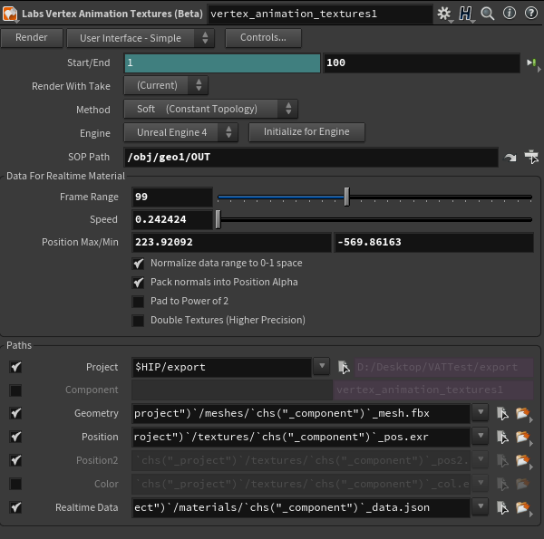
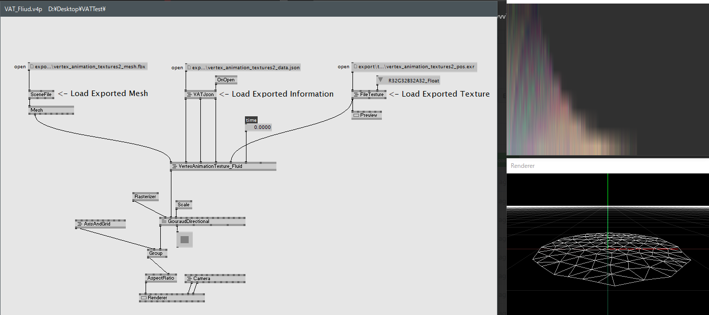

# VVVV-HoudiniVAT

HoudiniのVATから出力したジオメトリやテクスチャを、vvvvで読み込んで再生するサンプルです。  

テスト環境  
vvvv-beta38.2  
Houdini indie 18.0  
SideFX Labs 412  

exrの読み込みに[VVVV.Packs.Image](https://vvvv.org/contribution/vvvv.packs.image)が必要です。
# 使い方-Houdini側
SideFX Labsをインストールし、Labs Vertex Animetion Texturesノードを使用し、VATを出力します。  
詳しいことは[この辺り](https://houdinifx.jp/blog/vertex-animation-texture-%E3%81%AB%E3%81%A4%E3%81%84%E3%81%A6/)や、[この辺り](https://www.youtube.com/watch?v=qXcxBw3KUtw)を参照してください。基本的には、ジオメトリに応じてStart/End、Method、テクスチャ解像度(上の二つ目のリンクの動画で説明されています)をいじる以外はそのままで大丈夫だと思います。

とりあえず現状は、トポロジが変化しない頂点アニメーションの"Soft"とトポロジが変化する頂点アニメーションの"Fluid"に対応しています。  

# 使い方-vvvv側
基本的にはサンプルで入ってるパッチのような感じで出力された素材を読み込んで、timeを変化させれば動くと思います。ジオメトリはexport/meshes、jsonはexport/materials、テスクチャはexport/texturesにあります。  

ただし、jsonはファイル指定の際に、フィルタリングを"All Files(\*.\*)"にしないとjsonがひっかりません。  

また、jsonの読み込みは逐一ReadにBangを送らなければならないのと、ジオメトリの読み込み辺りは少し不安定なようで、適宜リロードなどしてあげてください。

